 

**개발자는 다양한 비즈니스 문제를 기술로 풀어가는 사람이라고 생각합니다.**  
클라우드 서비스를 활용한 백엔드 개발과 AI에 관심이 많습니다. 다양한 산업 분야의 프로젝트를 수행하며 서비스 개발, 배포, 운영 경험을 쌓아왔습니다.

## My values

- 🧩 **문제를 끝까지 해결합니다**  
  불편하고 비효율적인 업무를 발견하면, 원인을 구조화하고 개발로 더 나은 흐름을 만듭니다.

- 🌱 **배우고 기록하며 성장합니다**  
  어제보다 나은 코드를 작성하기 위해 꾸준히 학습하고, 배운 내용을 동료와 나누는 과정을 중요하게 생각합니다.

- 🚀 **기술로 비즈니스 성과를 만들었습니다**  
  새로운 기술을 꾸준히 습득하며, 안정적이고 비즈니스 가치가 높은 서비스를 만드는 개발자로 성장하고 있습니다.

## How I work

복잡한 문제일수록 먼저 사용자의 맥락과 비즈니스 목표를 이해하려고 합니다. 그 후 작게 검증할 수 있는 해결책부터 만들고, 운영 과정에서 얻은 피드백을 바탕으로 지속적으로 개선합니다.
새로운 기술을 빠르게 익히되, 유지보수성과 안정성을 놓치지 않는 개발을 지향합니다.

<!-- <h4 align="center">📚 Tech Stack 📚</h4>

  &nbsp 
  &nbsp 
  &nbsp 
  &nbsp 
   
  &nbsp
  &nbsp
  &nbsp
  &nbsp
  &nbsp
   
  &nbsp 
  &nbsp 
  &nbsp 
  &nbsp 

    
    
    
    
    

 -->

 

## GitHub activity

  

<!-- 

  

 -->

